[简体中文](README_zh.md) | English

#  LinkMind

LinkMind is enterprise-grade multimodal AI middleware for teams that need one stable layer between business systems, private knowledge, model providers, and agent runtimes. It focuses on fast onboarding, low-friction integration, routing and failover, RAG, multimodal APIs, and production governance.

## Introduction

The current codebase exposes a single middleware layer for chat, RAG, OCR, ASR/TTS, image and video workflows, text-to-SQL, embeddings, rerank, MCP access, skills, worker orchestration, and OpenAI-compatible APIs. It also includes runtime sync hooks for OpenClaw, Hermes Agent, and DeerFlow.

### Model And Runtime Ecosystem

**Models & Providers**

<table>
  <tr>
    <td> Azure OpenAI</td>
    <td>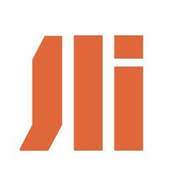 Baichuan</td>
    <td> ChatGLM</td>
    <td> Claude</td>
  </tr>
  <tr>
    <td>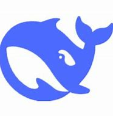 DeepSeek</td>
    <td>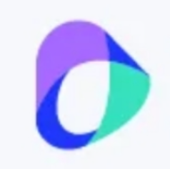 Doubao</td>
    <td> ERNIE</td>
    <td>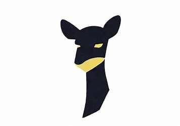 FastChat / Vicuna</td>
  </tr>
  <tr>
    <td>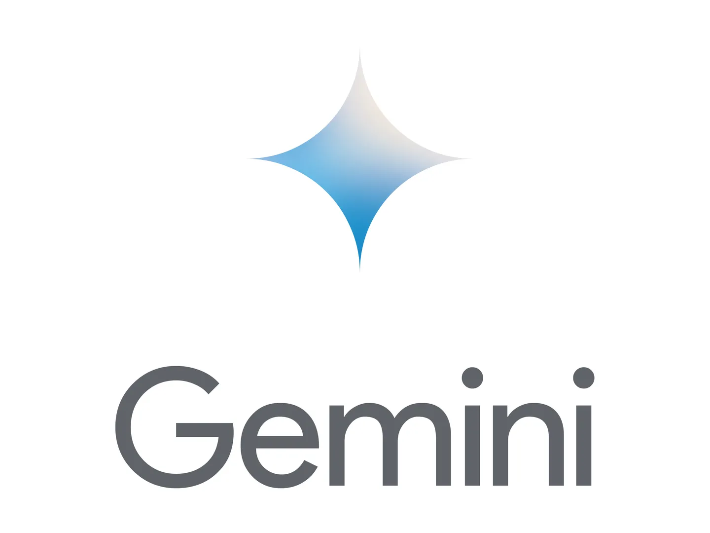 Gemini</td>
    <td> Grok</td>
    <td>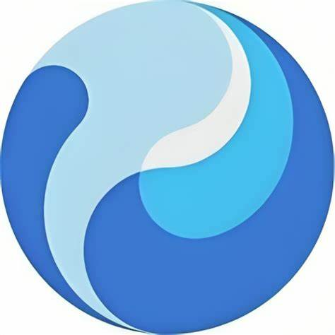 Hunyuan</td>
    <td>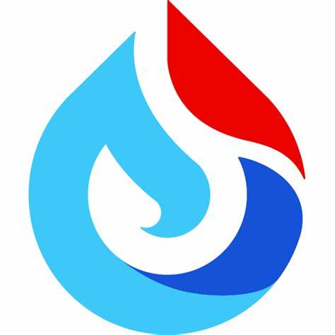 iFLYTEK Spark</td>
  </tr>
  <tr>
    <td> MiniMax</td>
    <td> Moonshot / Kimi</td>
    <td>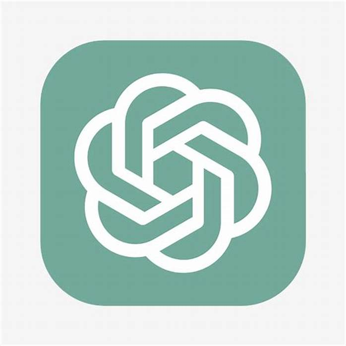 OpenAI</td>
    <td> OpenRouter</td>
  </tr>
  <tr>
    <td>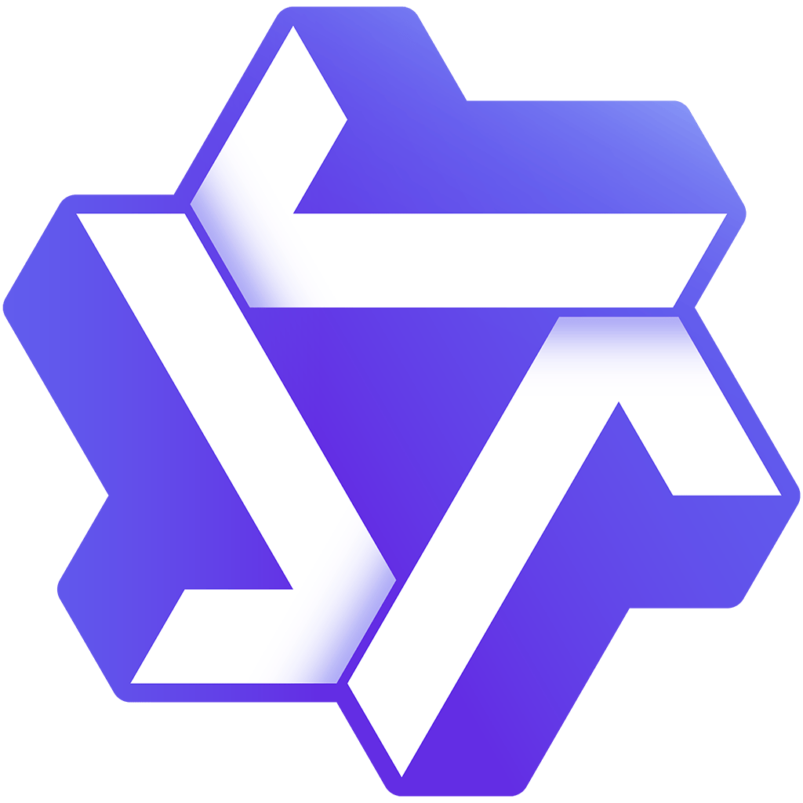 Qwen</td>
    <td>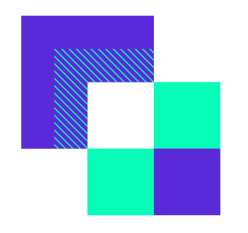 SenseChat</td>
    <td>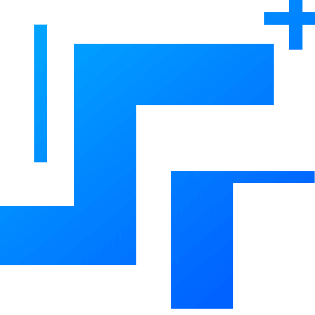 StepFun</td>
    <td>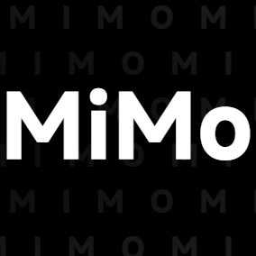 Xiaomi</td>
  </tr>
</table>

**Local Agent Frameworks**

<table>
  <tr>
    <td>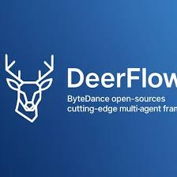 DeerFlow</td>
    <td>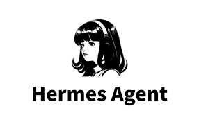 Hermes Agent</td>
    <td> OpenClaw</td>
  </tr>
</table>

**Cloud Agent Platforms**

<table>
  <tr>
    <td> Coze</td>
    <td> Hunyuan Agents</td>
    <td>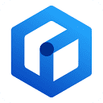 Wenxin Agents</td>
    <td> Zhipu Agents</td>
  </tr>
</table>

**Data & Retrieval**

<table>
  <tr>
    <td>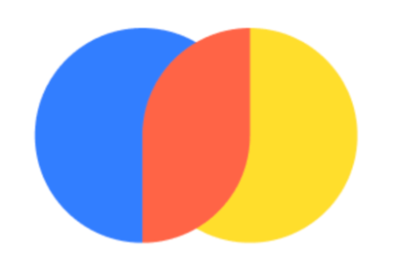 Chroma</td>
    <td> Elasticsearch</td>
    <td>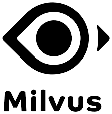 Milvus</td>
  </tr>
  <tr>
    <td> MySQL</td>
    <td>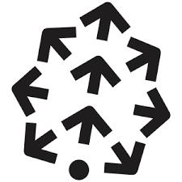 Pinecone</td>
    <td>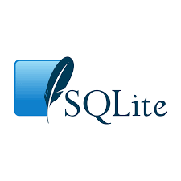 SQLite</td>
  </tr>
</table>

Entries are grouped by type and listed alphabetically. These ecosystems are extensible; the [Extension Guide](docs/extend_en.md) covers writing new model, vector-store, adapter, and secondary-development integrations. For Chroma setup specifics, see the [Annex](docs/annex_en.md).

## Why LinkMind

- One middleware layer covers chat, OCR, ASR/TTS, image generation, image and video understanding, text-to-SQL, embeddings, rerank, and document pipelines.
- Multi-model routing, failover, and orchestration are configured centrally in `lagi.yml`, so business systems do not need provider-specific rewrites.
- RAG can connect directly to Chroma, Elasticsearch, Milvus, MySQL, Pinecone, SQLite, and graph-style augmentation paths.
- Medusa cache acceleration, token statistics, filters, and runtime governance are built for real production stability and cost control.
- OpenClaw, Hermes Agent, and DeerFlow integration hooks make it easier to join existing agent workflows instead of rebuilding them.

  <a href="docs/images/img_25.png">
    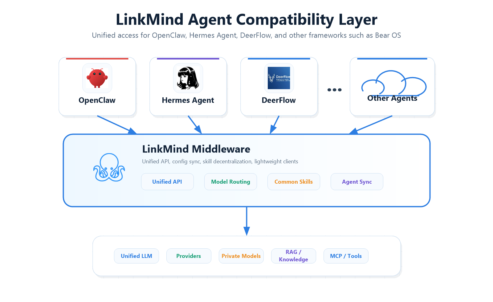
  </a>

## Get Started In Minutes

The following four methods are parallel options. Choose any one of them.

### Option 1. Official Installer

Prerequisite: install **JDK 8 or later** first. If you still need Java setup steps, jump to the [Installation Guide](docs/install_en.md#appendix-install-jdk-8).

- Windows PowerShell

  ```powershell
  iwr -useb https://cdn.linkmind.top/install.ps1 | iex
  ```

- macOS / Linux

  ```bash
  curl -fsSL https://cdn.linkmind.top/install.sh | bash
  ```

The installer supports two runtime choices:

| Mode | Use when |
| --- | --- |
| `Agent Mate` | You already use OpenClaw, Hermes Agent, or DeerFlow locally and want LinkMind to work as the shared middleware layer |
| <code>Agent&nbsp;Server</code> | You want a standalone LinkMind service first, or you are evaluating the web console and API directly |

### Option 2. Download Packaged Jar

Packaged downloads:

- Application package: `LinkMind.jar` ([Download](https://cdn.linkmind.top/installer/LinkMind.jar))
- Core library: `lagi-core-1.2.0-jar-with-dependencies.jar` ([Download](https://ai.linkmind.top/lagi/lib/lagi-core-1.2.0-jar-with-dependencies.jar))

```powershell
java -jar LinkMind.jar
```

On first run, LinkMind creates `config/`, `data/`, and the default `lagi.yml`. Then open `http://localhost:8080`.

### Option 3. With Docker Image

Prebuilt image: `landingbj/linkmind`

```bash
docker pull landingbj/linkmind
docker run -d -p 8080:8080 landingbj/linkmind
```

Then open `http://localhost:8080`.

### Option 4. Build from Source

```bash
mvn clean package -pl lagi-web -am -DskipTests -U
```

Current packaging generates:

- `lagi-web/target/LinkMind.jar`
- `lagi-web/target/ROOT.war`

More setup details are in the [Installation Guide](docs/install_en.md). For a guided first-run walkthrough, use the [Tutorial](docs/tutor_en.md).

After LinkMind is running, use the [Configuration Guide](docs/config_en.md) to enable providers, routes, filters, RAG, and other runtime settings in `lagi.yml`.

## API Surface

LinkMind exposes two route styles:

- Native LinkMind routes without extra version prefixes where the server already supports them, such as `/chat/completions`, `/audio/speech2text`, `/audio/text2speech`, `/image/text2image`, `/sql/text2sql`, `/instruction/generate`, `/doc/doc2ext`, and `/ocr/doc2ocr`
- OpenAI-compatible routes that intentionally keep the standard prefix, such as `/v1/chat/completions`, `/v1/models`, `/v1/embeddings`, `/v1/images/generations`, and `/v1/rerank`

One current exception is the vector administration namespace, which is still mapped in code as `/v1/vector/*`. Full endpoint documentation is in the [API Reference](docs/API_en.md).

## Customization API

LinkMind keeps secondary-development entry points behind object-oriented boundaries so teams can extend behavior without rewriting the main request flow.

- `Communication and out-of-band data`: OpenAI-compatible chat requests accept `extra_body`, and runtime helpers handle encoding, decoding, and current-user injection without pushing business parsing into the adapter itself. Existing completion, streaming, and cascade flows remain unchanged.
- `Skill-level social data`: social interaction data is encapsulated in skills and service classes, then exposed through `/socialChannel/*`. If you do not enable social skills, the original chat and token flow stays intact.
- `Authentication, API-key, and billing`: `/user/*`, `/apiKey/*`, and `/credit/*` form the stable HTTP surface for account binding, key-pool management, and charging workflows. You can replace the backing service logic while preserving the external contract.

This split gives two practical benefits for secondary development: zero-invasive integration with the current codebase, and opt-in adoption so you only enable the interfaces your deployment actually needs.

## Agent Runtime Integration

- **OpenClaw**: LinkMind can inject itself as an OpenAI-compatible provider and can also load model selections back from OpenClaw into `lagi.yml`.
- **Hermes Agent**: LinkMind can import and export model settings through `~/.hermes/config.yaml` and `.env`.
- **DeerFlow**: LinkMind can import and export model settings through DeerFlow `config.yaml` and `.env`.

If you want the shortest evaluation path, start with `Agent Server`, verify the web console and API, then switch to `Agent Mate` when you are ready to connect LinkMind to your existing agent runtime stack.

## Core Features

### 1. RAG + Embedding

Turn private files, QA pairs, and structured knowledge into retrievable context through vector stores, embeddings, OCR, and document ingestion pipelines.

### 2. Medusa

Use built-in cache acceleration to shorten repeat response latency and improve runtime efficiency in real production traffic.

### 3. Airank

Route, rank, fail over, and orchestrate multiple models centrally through routers such as `best(...)` and `pass(...)` instead of hard-coding provider logic in each app.

### 4. Security & Safety

Centralize guardrails, policy checks, data handling, access control, provider governance, and deployment responsibilities through the [Security & Safety document](docs/security_en.md).

### 5. Graph

Augment retrieval and intent understanding with graph-style context so the middleware can make more stable decisions for complex enterprise knowledge scenarios.

### 6. Cascade Networking

Compose many LinkMind nodes into a larger router-like tree network. Each Agent Server manages its own concurrency and local data, while cascade links stitch distributed agents together and preserve physical and logical isolation for data and permissions.

### 7. OpenClaw Plugin

Connect LinkMind to the OpenClaw ecosystem as a plugin-friendly, OpenAI-compatible context and provider layer instead of wiring each model separately.

To integrate these capabilities into your application via `lagi-core` or REST APIs, see the [Integration Guide](docs/guide_en.md).

<table width="100%">
  <tr>
    <td valign="top" width="50%">
      <h2>License</h2>
      <p>This project is distributed under the <a href="LICENSE">LICENSE</a>.</p>
    </td>
    <td valign="top" width="50%">
      <h2>Online Demo</h2>
        Public&nbsp;demo:&nbsp;<a href="https://linkmind.landingbj.com/">https://linkmind.landingbj.com/</a>
    </td>
  </tr>
</table>
