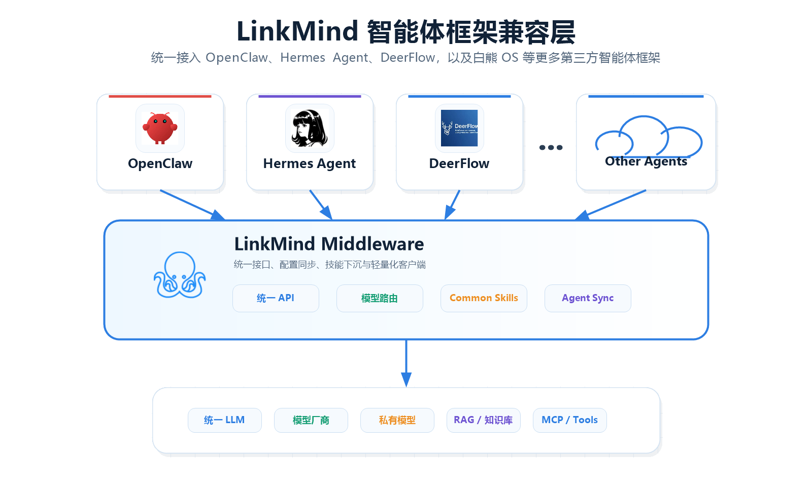

简体中文 | [English](README.md)

#  LinkMind

LinkMind 是面向企业场景的多模态 AI 中间件，用来把业务系统、私有知识、模型厂商和 Agent 运行时统一接到一层可治理、可扩展、可上线的能力层里。它优先解决的是企业真正落地时最常见的几个问题：上手慢、接入碎、成本高、稳定性差。

## 项目简介

当前代码已经覆盖统一聊天入口、RAG、OCR、ASR/TTS、图片与视频能力、文档处理、Text-to-SQL、Embedding、Rerank、MCP、Skills、Worker 编排，以及 OpenAI 兼容接口。同时，项目还内置了 OpenClaw、Hermes Agent、DeerFlow 的配置同步能力，便于接入现有 Agent 工作流。

### 模型与运行时生态

**模型与提供方**

<table>
  <tr>
    <td> Azure OpenAI</td>
    <td> Baichuan</td>
    <td> ChatGLM</td>
    <td> Claude</td>
  </tr>
  <tr>
    <td> DeepSeek</td>
    <td> Doubao</td>
    <td> ERNIE</td>
    <td> FastChat / Vicuna</td>
  </tr>
  <tr>
    <td> Gemini</td>
    <td> Grok</td>
    <td> Hunyuan</td>
    <td> iFLYTEK Spark</td>
  </tr>
  <tr>
    <td> MiniMax</td>
    <td> Moonshot / Kimi</td>
    <td> OpenAI</td>
    <td> OpenRouter</td>
  </tr>
  <tr>
    <td> Qwen</td>
    <td> SenseChat</td>
    <td> StepFun</td>
    <td> Xiaomi</td>
  </tr>
</table>

**本地 Agent 框架**

<table>
  <tr>
    <td> DeerFlow</td>
    <td> Hermes Agent</td>
    <td> OpenClaw</td>
  </tr>
</table>

**云端 Agent 平台**

<table>
  <tr>
    <td> Coze</td>
    <td> Hunyuan Agents（混元智能体）</td>
    <td> Wenxin Agents（文心智能体）</td>
    <td> Zhipu Agents（智谱智能体）</td>
  </tr>
</table>

**Data & Retrieval（数据与检索）**

<table>
  <tr>
    <td> Chroma</td>
    <td> Elasticsearch</td>
    <td> Milvus</td>
  </tr>
  <tr>
    <td> MySQL</td>
    <td> Pinecone</td>
    <td> SQLite</td>
  </tr>
</table>

以上条目按类型分组，并按英文名称字母顺序排列。新增模型、向量库、适配器或二次开发接口的方式见[扩展开发文档](docs/extend_zh.md)。Chroma 的具体安装与补充说明见[附件](docs/annex_zh.md)。

## 为什么选 LinkMind

- 一层中间件同时覆盖聊天、OCR、ASR/TTS、图片生成、图像与视频理解、Text-to-SQL、Embedding、Rerank、文档处理等能力。
- 多模型路由、故障切换和编排统一配置在 `lagi.yml` 中，业务系统不用为不同厂商重复改接口。
- RAG 可以直接接到 Chroma、Elasticsearch、Milvus、MySQL、Pinecone、SQLite 等检索组件，也能继续扩展图谱类增强能力。
- Medusa 缓存加速、Token 统计、过滤器和运行时治理，都是面向真实生产场景的稳定性与成本问题设计的。
- OpenClaw、Hermes Agent、DeerFlow 的接入钩子已经内置，适合在现有 Agent 工作流里逐步落地。

  <a href="docs/images/img_24.png">
    
  </a>

## 几分钟上手

下面 4 种方式是并列选项，任选其一即可。

### 选项1：官方安装脚本快速安装

前置要求：先安装 **JDK 8 或以上版本**。如果还没装 Java，可直接跳到[安装指南](docs/install_zh.md#附录安装-jdk-8)中的附录。

- Windows PowerShell

  ```powershell
  iwr -useb https://cdn.linkmind.top/install.ps1 | iex
  ```

- macOS / Linux

  ```bash
  curl -fsSL https://cdn.linkmind.top/install.sh | bash
  ```

安装器支持两种运行模式：

| 模式 | 适用场景 |
| --- | --- |
| `Agent Mate` | 本机已经在使用 OpenClaw、Hermes Agent、DeerFlow，希望 LinkMind 作为统一中间层接入 |
| `Agent Server` | 先单独启动 LinkMind，直接体验控制台和 API，或做独立部署评估 |

### 选项2：下载并运行 JAR 包

预打包资源：

- 应用文件：`LinkMind.jar`，[点击这里下载](https://cdn.linkmind.top/installer/LinkMind.jar)
- 核心库文件：`lagi-core-1.2.0-jar-with-dependencies.jar`，[点击这里下载](https://ai.linkmind.top/lagi/lib/lagi-core-1.2.0-jar-with-dependencies.jar)

```powershell
java -jar LinkMind.jar
```

首次启动会自动生成 `config/`、`data/` 和默认的 `lagi.yml`，随后访问 `http://localhost:8080` 即可。

### 选项3：使用 Docker 镜像

镜像名称：`landingbj/linkmind`

```bash
docker pull landingbj/linkmind
docker run -d -p 8080:8080 landingbj/linkmind
```

启动后访问 `http://localhost:8080`。

### 选项4：从源码编译

```bash
mvn clean package -pl lagi-web -am -DskipTests -U
```

当前打包结果为：

- `lagi-web/target/LinkMind.jar`
- `lagi-web/target/ROOT.war`

更完整的安装说明见 [安装指南](docs/install_zh.md)。如需跟着示例一步步跑通，请参考[教学演示](docs/tutor_zh.md)。

启动 LinkMind 后，可继续查看 [配置指南](docs/config_zh.md)，启用 `lagi.yml` 中的模型、路由、过滤器、RAG 等运行配置。

## 接口风格

LinkMind 当前同时暴露两套路由风格：

- LinkMind 原生路由，例如 `/chat/completions`、`/audio/speech2text`、`/audio/text2speech`、`/image/text2image`、`/sql/text2sql`、`/instruction/generate`、`/doc/doc2ext`、`/ocr/doc2ocr`
- OpenAI 兼容路由，例如 `/v1/chat/completions`、`/v1/models`、`/v1/embeddings`、`/v1/images/generations`、`/v1/rerank`

当前有一个仍按代码映射保留在 `/v1` 命名空间下的例外：向量管理接口 `/v1/vector/*`。完整的接口文档见 [API 参考](docs/API_zh.md)。

## 二次开发接口

LinkMind 将二次开发能力放在清晰的面向对象边界之后，便于在不改动主流程的前提下扩展业务能力。

- `通讯层与带外数据`：OpenAI 兼容请求支持 `extra_body`，运行时通过专门的工具类完成编码、解码和当前用户注入，不把业务解析逻辑塞进 Adapter 主链路，因此不会影响既有补全、流式输出和级联调用。
- `Skill 层社交数据`：社交交互数据封装在 Skill 与 Service 内部，并通过 `/socialChannel/*` 对外暴露。如果不启用社交 Skill，原有聊天流程和 Token 路径保持不变。
- `认证、API Key 与计费`：`/user/*`、`/apiKey/*`、`/credit/*` 构成稳定的对外接口层，用于账号绑定、Key 池管理和计费流程接入，业务方可以替换后端实现而不改变接口协议。

这种分层方式让二开具备两个直接优势：对现有代码零侵入，以及按需启用。你可以只接入自己需要的接口，而不必重写整套运行时。

## Agent 运行时集成

- **OpenClaw**：可以把 LinkMind 注入为 OpenAI 兼容 Provider，也可以把 OpenClaw 的模型选择反向同步回 `lagi.yml`
- **Hermes Agent**：可以通过 `~/.hermes/config.yaml` 和 `.env` 导入导出模型配置
- **DeerFlow**：可以通过 DeerFlow 的 `config.yaml` 和 `.env` 导入导出模型配置

如果你只是首次评估，建议先用 `Agent Server` 跑通控制台与 API；确认稳定后，再切到 `Agent Mate` 接入现有 Agent 运行时。

## 核心功能

### 1. RAG + Embedding

把私有文档、问答对和结构化知识转成可检索上下文，通过向量库、Embedding、OCR 与文档处理流水线支撑真实知识库问答。

### 2. Medusa

通过内置缓存加速层缩短重复请求的响应时间，让模型运行在真实业务流量下更稳、更快。

### 3. Airank（路由与编排）

利用 `best(...)`、`pass(...)` 等路由规则统一完成多模型选择、排序、故障切换与编排，而不是把厂商逻辑散落在各个业务系统里。

### 4. 安全与合规

通过[安全与合规文档](docs/security_zh.md)集中说明安全围栏、策略检查、数据处理、访问控制、模型提供方治理与部署责任边界。

### 5. Graph

在向量检索之外补充图谱类上下文增强和意图理解能力，适合更复杂的企业知识与推理场景。

### 6. 级联组网

采用类似“路由器”的树状主网结构，把多个 LinkMind 组成更大的网。各节点（Agent Server）自主管理并发和本地数据，通过级联能力将散装的智能体拼接到一起，同时保障数据和权限的物理与逻辑隔离。

### 7. OpenClaw 插件

把 LinkMind 作为 OpenClaw 生态里可插拔、兼容 OpenAI 的上下文层与 Provider 层来接入，而不是逐个模型分散配置。

如需将这些能力通过 `lagi-core` 或 REST API 接入到业务系统，请继续阅读[开发集成指南](docs/guide_zh.md)。

<table width="100%">
  <tr>
    <td valign="top" width="50%">
      <h2>License</h2>
      <p>本项目遵循 <a href="LICENSE">LICENSE</a>。</p>
    </td>
    <td valign="top" width="50%">
      <h2>演示参看</h2>
      <p>演示地址：<a href="https://linkmind.landingbj.com/">https://linkmind.landingbj.com/</a></p>
    </td>
  </tr>
</table>
