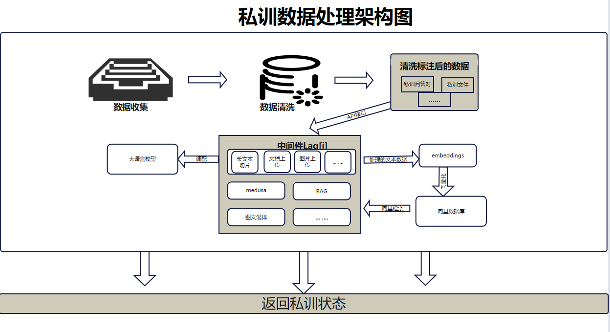
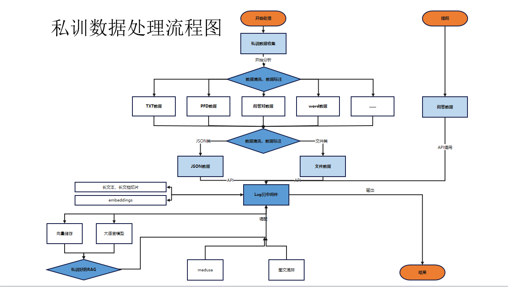

# 教学演示

这份教程的目标是帮你从零到可用地跑通 LinkMind，同时不再把产品里仍然存在的功能过度删减。建议先读 **基础（Essential）**，再继续读 **进阶（Advanced）**。

## 第一部分：基础（Essential）

## 一、先启动 LinkMind

先按 [安装指南](install_zh.md) 启动 LinkMind。下面 4 种方式是并列选项，任选其一即可：

- 官方安装脚本
- 预打包 JAR
- Docker 镜像
- 源码编译

服务启动后，浏览器打开：

- `http://localhost:8080`

## 二、完成第一份可用配置

开始测试之前，请先确保至少配置了一个真实可用的模型密钥。

最短路径通常是：

1. 登录控制台。
2. 打开模型或 API Key 设置页。
3. 填入一个模型厂商的真实密钥。
4. 在 `lagi.yml` 中启用一个聊天后端。

一个最小可用聊天配置示例如下：

```yaml
models:
  - name: qwen
    type: Alibaba
    enable: true
    model: qwen-plus,qwen-max
    driver: ai.wrapper.impl.AlibabaAdapter
    api_key: your-api-key
    # 如果有多个 Key，可改用 Key 池：
    # api_keys: sk-key1,sk-key2,sk-key3
    # key_route: polling  # polling（轮询）或 failover（故障转移）

functions:
  chat:
    route: pass(qwen)
    backends:
      - backend: qwen
        model: qwen-plus
        enable: true
        stream: true
        priority: 100

routers:
  enable: true
  items:
    - name: pass
      rule: (%)
```

## 三、先在控制台验证聊天

回到聊天页，发送一条简单消息，例如：

- `请用一段话介绍 LinkMind。`

如果能正常得到回复，说明第一条模型链路已经跑通。

## 四、再验证 HTTP 接口

### LinkMind 原生路由

```bash
curl http://localhost:8080/chat/completions \
  -H "Content-Type: application/json" \
  -d '{
    "model": "qwen-plus",
    "stream": false,
    "messages": [
      {"role": "user", "content": "列出 LinkMind 的三个核心能力。"}
    ]
  }'
```

### OpenAI 兼容路由

```bash
curl http://localhost:8080/v1/chat/completions \
  -H "Content-Type: application/json" \
  -d '{
    "model": "qwen-plus",
    "stream": false,
    "messages": [
      {"role": "user", "content": "列出 LinkMind 的三个核心能力。"}
    ]
  }'
```

如果系统开启了鉴权，请加上：

```http
Authorization: Bearer <你的-linkmind-api-key>
```

## 五、启用 RAG

如果你希望回答建立在自己的知识数据上，建议按这个顺序做：

1. 启动 Chroma。
2. 把 `stores.vector[*].url` 指向 Chroma。
3. 打开 `stores.rag`。
4. 配置一个 Embedding 后端。
5. 通过控制台或向量接口写入知识内容。

Chroma 快速启动：

```bash
pip install chromadb
mkdir db_data
chroma run --path db_data
```

然后补上：

```yaml
stores:
  vector:
    - name: chroma
      driver: ai.vector.impl.ChromaVectorStore
      url: http://localhost:8000

  rag:
    vector: chroma
    enable: true
```

## 六、试一下多模态能力

当前服务端仍然保留这些常见能力：

- `POST /audio/speech2text`
- `GET /audio/text2speech`
- `POST /image/text2image`
- `POST /image/image2ocr`
- `POST /image/image2text`
- `POST /image/image2enhance`
- `POST /image/image2video`
- `POST /video/video2tracking`
- `POST /video/video2enhance`
- `POST /ocr/doc2ocr`
- `POST /doc/doc2ext`
- `POST /doc/doc2struct`
- `POST /sql/text2sql`

具体请求示例请查看 [API 参考](API_zh.md)。

## 七、可选：接入 Agent 运行时

如果你的本地工作流已经有 OpenClaw、Hermes Agent 或 DeerFlow：

1. 以 `Agent Mate` 模式重新安装或重启 LinkMind。
2. 检查运行时配置路径是否正确。
3. 让 LinkMind 充当统一中间层，而不是业务系统分别直连各个模型厂商。

## 八、下一步建议

- 调整模型、路由、过滤器和 RAG：看 [配置参考](config_zh.md)
- 接入自己的业务系统：看 [开发集成指南](guide_zh.md)
- 扩展模型或向量库：看 [扩展开发文档](extend_zh.md)

## 第二部分：进阶（Advanced）

## 九、从源码构建、IDE 调试或部署 WAR

如果你需要更典型的开发者工作流，这些方式依然有效。

### Maven 打包

```bash
git clone https://github.com/landingbj/lagi.git
cd lagi
mvn clean package -pl lagi-web -am -DskipTests -U
```

构建产物：

- `lagi-web/target/LinkMind.jar`
- `lagi-web/target/ROOT.war`

### IDE 调试

你仍然可以把项目导入 IntelliJ IDEA 或 Eclipse，本地编译并按自己的调试配置启动。

### WAR / Tomcat 部署

如果团队依然偏向传统 Servlet 容器：

1. 构建 `ROOT.war`。
2. 放入 Tomcat 的 `webapps`。
3. 保持 `lagi.yml` 与独立 JAR 启动时相同的模型与存储配置。

## 十、模型切换与路由编排

LinkMind 并不只支持一个聊天后端。你可以保留多个模型后端，再用路由规则统一调度。

示例：

```yaml
functions:
  chat:
    route: best((landing&qwen),(kimi|chatgpt))
    backends:
      - backend: landing
        model: cascade
        enable: true
        stream: true
        priority: 350

      - backend: qwen
        model: qwen-plus
        enable: true
        stream: true
        priority: 100

      - backend: kimi
        model: moonshot-v1-8k
        enable: true
        stream: true
        priority: 90
```

常见路由规则：

- `A|B`：轮询
- `A,B`：故障转移
- `A&B`：并行

## 十一、私训问答对

私训问答对仍然是产品能力的一部分，尤其适合需要把结构化业务知识快速接入的场景，不应该从教程里删掉。

推荐流程：

1. 准备领域 FAQ 或人工整理好的问答对。
2. 用 LinkMind 把它们整理成清晰、可复用的 QA 数据。
3. 写入对应知识分类，让 RAG 在对话中检索使用。

### 私训数据处理架构图



### 私训数据处理流程图



### 实操建议

- 一条问答尽量只覆盖一个明确主题。
- 问题尽量按真实用户提问方式来写。
- 答案先短后长，先保证可检索性，再补充完整解释。
- 不同业务域尽量拆分不同分类，减少互相干扰。

## 十二、生成指令集

当你希望把文档进一步转成适合训练或抽取 QA 的素材时，可以使用指令集生成功能。

通常建议遵循这些抽取原则：

1. 从原始文档中提取结构清晰的问题和答案。
2. 将关键信息压缩成准确、简洁的回答。
3. 保留后续训练或检索所需的必要上下文。
4. 按主题拆分，而不是整份文档一次性塞成一个块。

具体请求方式可查看 [API 参考](API_zh.md)。

## 十三、上传私训学习文件

上传私训学习文件依然是构建内部知识库的重要路径。

你可以通过控制台完成，也可以根据工作流选择 `/uploadFile/*`、`/training/*` 以及文档/向量相关接口来做文件入库。

### 支持的文件格式

- 文本类：`txt`、`doc`、`docx`、`pdf`
- 表格类：`xls`、`xlsx`、`csv`
- 图片类：`jpeg`、`png`、`jpg`、`webp`
- 演示文稿：`ppt`、`pptx`

### 文件处理策略

不同文件类别仍然采用不同的处理方式：

1. 问答文件：自动抽取并拆分问答对。
2. 章节型文档：清理结构噪音后，尽量保留完整段落。
3. 表格与电子表：转成更适合模型理解的结构化内容。
4. 纯数字型表格：可与 text-to-SQL、关系库能力配合使用。
5. 图文混排文件：联合 OCR 和版面理解一起处理。
6. 标题明显的文件：把标题保留为独立知识锚点。
7. 演示文稿：按页处理文本与图片内容。
8. 纯图片文件：通过 OCR 或图像理解转成可检索内容。
